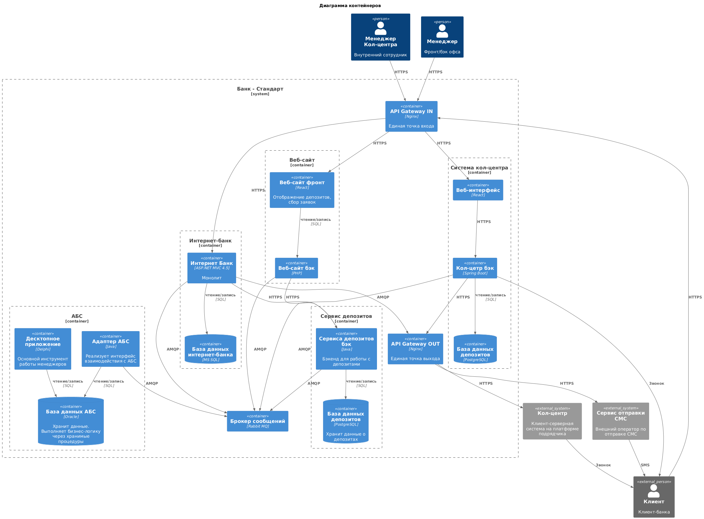

### **Название задачи: Открытие депозитов онлайн**
### **Автор: Галонза Пётр Валерьевич**
### **Дата: 22.06.2925**
### **Функциональные требования**
Опишите здесь верхнеуровневые Use Cases. Их нужно оформить в виде таблицы с пошаговым описанием:

|**№**|**Действующие лица или системы**|**Use Case**|**Описание**|
| :-: | :- | :- | :- |
|||||
| U1 | Пользователь>Веб-сайт | Подача заявки через сайт | Пользователь заполняет форму с ФИО и телефоном. Система отправляет данные в кол-центр для дальнейшей обработки |
| U2 | Пользователь>Интернет-банк>AБС | Подача заявки через интернет-банк | Пользователь указывает счет и сумму. Система запрашивает SMS-подтверждение операции |
| U3 | Пользователь>Интернет-банк/Веб-сайт | Отображение депозитов | Система показывает актуальный список депозитов с общедоступными и персонализированными ставками |
| U5 | Менеджер>АБС | Работа со ставками | АБС загружает ставки по депозитам, возможен импор XLS-файла |
### **Нефункциональные требования**

|**№**|**Требование**|
| :-: | :- |
| 1 | Использование шифрования трафика на Веб-сайте и в интернет-банке |
| 2 | Использование только технологий с текущего стека |
| 3 | Доступность 99.9% сервисов интернет-банка и Веб-сайта |
| 4 | Поддержка масштабирования интернет-банка горизонтально |
| 5 | Минимизация доработок компонентов системы |
| 6 | Минимальное время отклика интерфейса (<1 мс) |
| 7 | Резервное копирование и отказоустойчивость |
| 8 | Заложить возможность перехода на микросервисную архитектуру |
| 9 | Избежать взамодействие интернет банка с АБС по API |
### **Решение**

* Использование текущего стэка
* Минимизация доработок компонентов системы
* RabbitMQ для обмена сообщениями между компонентами системы т.к. имеет решения по интеграции с текущим стэком. Повысит надежность системы.
* Микросервисная архитектура для депозитов позволит выделить занчимую чать бизнес функционала и дорабатывать отдельно, не затрагивая остальную часть системы.
* Gateway для входящих и выходящих запросов, позволит контролировать, лимитировать, балансировать запросы что добовляет габкости в текущую системы.
* Адаптер для работы с АБС предоставит удобный интерфейс для интеграций, работа напрямую в БД различными компонентами несет в себе риски.
* Можно масштабировать горизонтально

### **Альтернативы**

* Сделать полноценный backend сервис для работы с АБС.
* Вместо очередей RabbitMQ использовать асинхронные запросы.
* Дорабатывать текущие решения(Интернет банк, Веб-сайт)

**Недостатки, ограничения, риски**

* АБС узкое место из-за ограничений в масштабировании
* Необходимость нарастить компетенции в Nginx и RabbitMQ
* Отсуствуеют системы обеспечения безопасности данных
* Рески связанные с сроками изза необходимости перехода на RabbitMQ и микросервисную архитектуру для депозитов.
* Отсутсвует зрелость текущего ландшафта.
* Клиент АБС напрямую работает с БД.
* Требуется выделение сотрудников на написание адаптера, микросервисов и изменения взаимодействия между компонентами.
