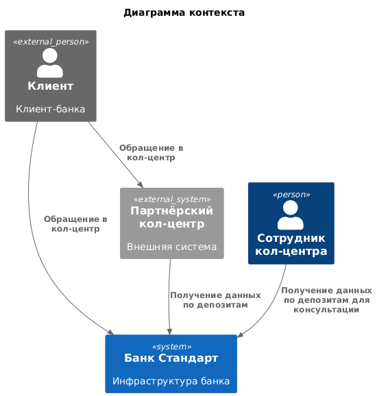
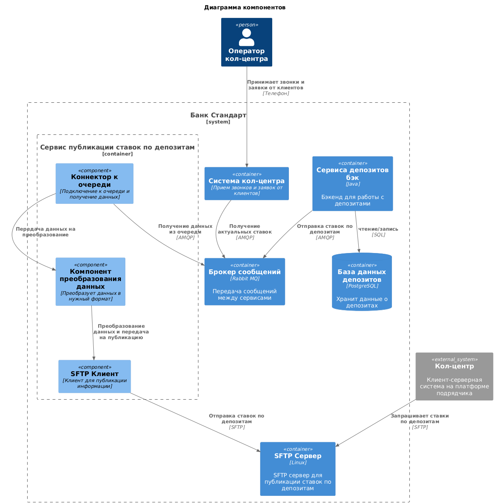

### **Название задачи: Интернет банк**
### **Автор: Галонза Пётр Валерьевич**
### **Дата: 28.06.2925**
### **Функциональные требования**
Опишите здесь верхнеуровневые Use Cases. Их нужно оформить в виде таблицы с пошаговым описанием:

|**№**|**Действующие лица или системы**|**Use Case**|**Описание**|
| :-: | :- | :- | :- |
|U1|Пользователь>Сотрудник кол-центра/партнерского кол-центра|Консультация по текущим ставкам в банке|Клиент обращается в кол-центр за консультацией, сотрудник кол-центра предоставляет информацию по текущим ставкам|
### **Нефункциональные требования**

|**№**|**Требование**|
| :-: | :- |
|1|Доступ сотрудников кол-центра к информации о депозатах|
|2|Передача информации о ставках партнерскому кол-центру в виде файлов|
### **Решение**

* Использование текущего стэка
* Минимизация доработок компонентов системы
* Использование простых решений
* Гибкость в реализации решений
* SFTP проверенный протокол, с реализацией на множестве языков
* SFTP является простым и надежным решением
* Отказоустойчивость системы, при недоступности сервиса депозитов, кол-центр может продолжать свою работу по консультации
* Функционал по публикации информации легко убрать из системы при ненадобности.

### **Альтернативы**

* Отправка информации о ставках партнерскому кол-центру по почте(не безопасно)
* Поиск партнерского кол-центра с возможностью интеграции по API
* Реализация сайта для партнеров кол-центра(Требует дополнительного соглашения, разработки и обучения)

**Недостатки, ограничения, риски**

* Публикация SFTP наружу
* Доработка системы кол-центра для получения информации о депозитах и сохранении в базе данных
* Риск взлома SFTP и горизонтального перемещения внутри периметра
* Надо проработать аутентификацию с кол-центром партнера
